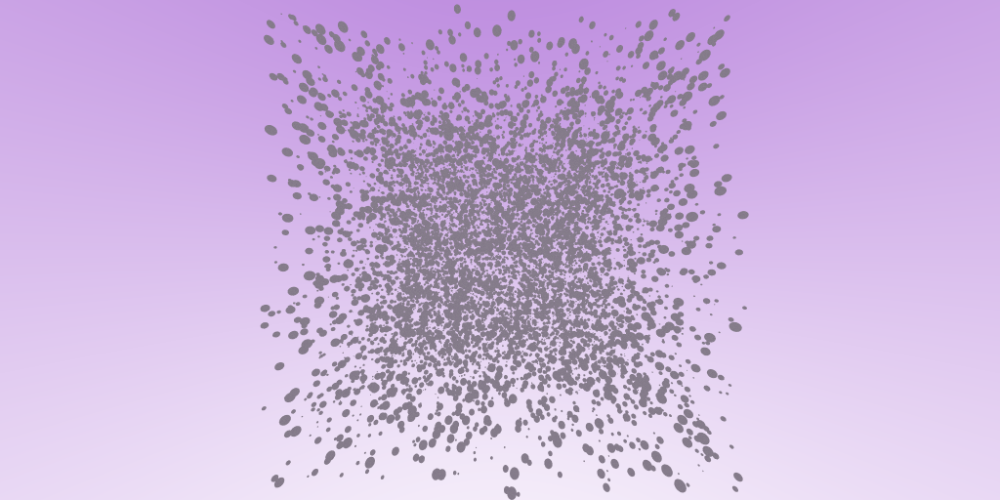
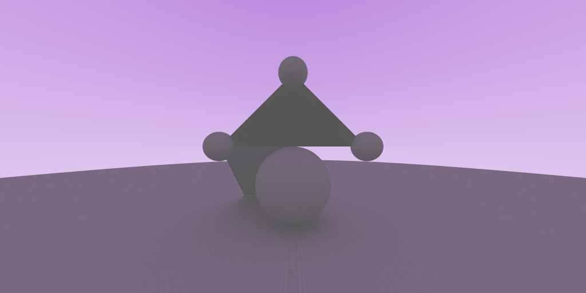
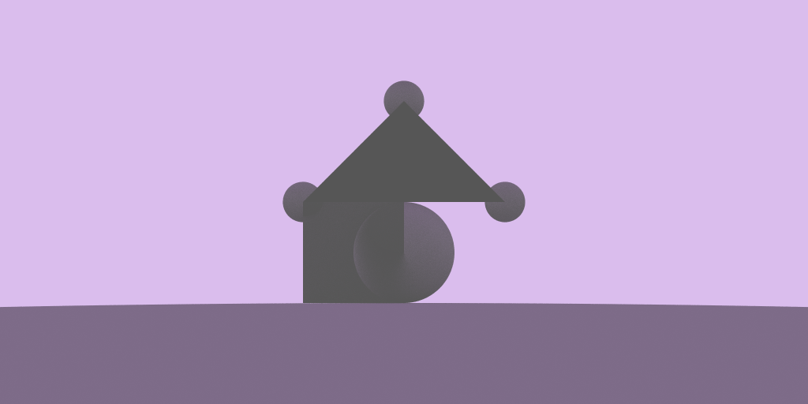

# raycypp
Bare-bones C++ ray tracer.

## Images

## Acknowledgements
- *Ray Tracing in One Weekend* by Peter Shirley
- The fantastic `GLM` and `libPNG` libraries
- The Möller–Trumbore intersection algorithm on Wikipedia for triangle
  intersection
- *Physically Based Rendering* by Matt Pharr, Wenzel Jakob, and Greg Humphreys

<!--  LocalWords:  raycypp
 -->
